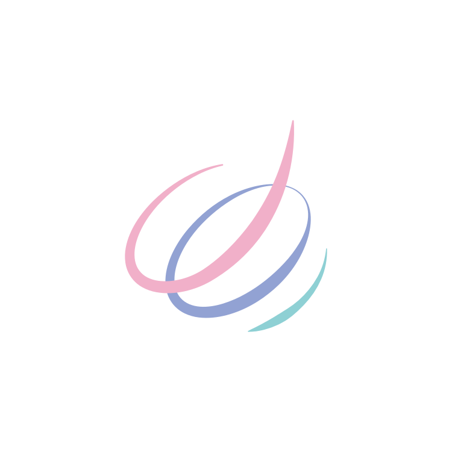
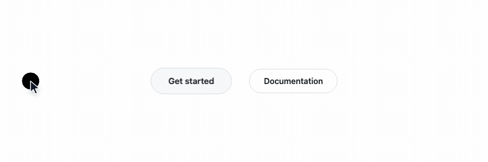
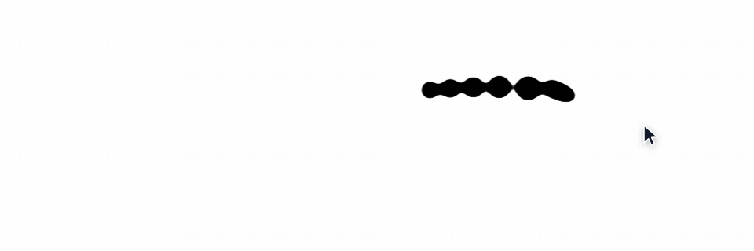
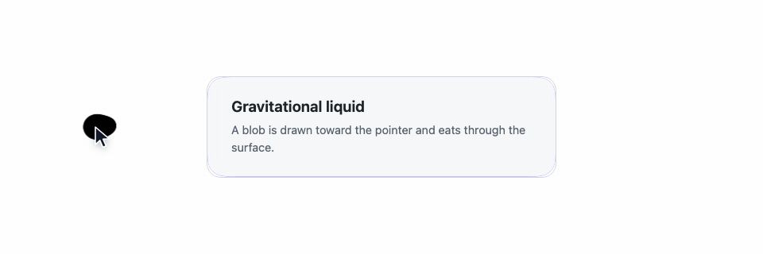

<p align="center">
  
</p>

<h1 align="center">magnet-cursor</h1>

<p align="center">
  <strong>Make the cursor part of the page.</strong>
  <br>
  <sub>A lightweight, composable cursor and magnetic interaction library for Vue 3, React and plain JavaScript.</sub>
</p>

<p align="center">
  <a href="https://github.com/JoiHouse/magnet-cursor">
    
  </a>
  <a href="https://www.npmjs.com/package/@joihouse/magnet-cursor-core">
    
  </a>
  <a href="https://github.com/JoiHouse/magnet-cursor/actions/workflows/ci.yml">
    
  </a>
  
  
  
</p>

<p align="center">
  <a href="https://cursor.joia.cn">
    
  </a>
</p>

<p align="center">
  <a href="./README.md">English</a>
  ·
  <a href="./README.zh-CN.md">简体中文</a>
</p>

---

## Why magnet-cursor?

On a traditional web page, the cursor is just a pointer.

All it says is: "you are pointing here."

magnet-cursor wants it to do more:

> **Let the pointer take part in the interaction.**

It can follow the mouse with momentum and a trail;

it can pull at buttons, tilting elements gently toward the pointer;

it can merge into a button on hover, or trace a link's outline;

and it can behave like a body of liquid — dragged, stretched, and eroding its way across a surface.

You do not have to redesign your page.

**You only add a little interaction to the elements you already have.**

---

## What can you build?

### Magnetic elements

Give buttons, cards and images a pull on the pointer.

As the mouse comes closer, the element leans toward it;

once the mouse leaves, it springs back on its own.

<p align="center">
  <picture>
    <source media="(prefers-color-scheme: dark)" srcset=".github/merge-dark.gif">
    
  </picture>
</p>

<p align="center">
  <sub>Elements respond to pointer movement instead of simply waiting for hover.</sub>
</p>

---

### Merge

Let the cursor and the element become one.

The cursor can:

- take over the button's shape
- become the button's background
- trace the element's border
- wipe a moving underline beneath a link

A good fit for:

- landing pages
- portfolios
- SaaS marketing sites
- creative sites
- brand sites
- product pages

```html
<button data-magnet-cursor-morph="fill">Hover me</button>
```

---

### Liquid trail

Give the cursor a liquid-like path.

The faster it moves, the more its shape shows;

when it stops, the liquid settles back on its own.

<p align="center">
  <picture>
    <source media="(prefers-color-scheme: dark)" srcset=".github/trail-dark.gif">
    
  </picture>
</p>

<p align="center">
  <sub>The drops are fused into one continuous liquid path by an SVG goo filter.</sub>
</p>

---

### Gravitational liquid

For something bolder, a body of liquid can chase the pointer.

It does not merely follow.

It:

- gets pulled by the pointer
- deforms according to its speed
- lags behind
- passes across the element's surface
- eats into what it crosses as it moves

<p align="center">
  <picture>
    <source media="(prefers-color-scheme: dark)" srcset=".github/liquid-dark.gif">
    
  </picture>
</p>

---

## You don't have to build this from scratch

magnet-cursor packages the common cursor interactions into APIs you can use directly.

| Capability           | What it is for                         |
| -------------------- | -------------------------------------- |
| Follow               | The cursor eases after the mouse       |
| Magnet               | Elements are attracted and tilt        |
| Morph                | The cursor merges with an element      |
| Underline            | A moving underline for links           |
| Trail                | The liquid trail                       |
| Gravitational Liquid | The gravitational liquid               |
| Frame Scheduler      | Frames are only spent when needed      |
| Reduced Motion       | Adapts to reduced-motion settings      |
| Touch Safe           | Steps aside on touch devices           |
| SSR Safe             | Safe to import in a server environment |

---

# 📦 Install

Pick the approach that matches your project.

| Your stack       | How you pull it in              | Good for                        |
| ---------------- | ------------------------------- | ------------------------------- |
| Vue 3 / Nuxt     | `@joihouse/magnet-cursor-vue`   | Vue projects                    |
| React / Next.js  | `@joihouse/magnet-cursor-react` | React projects                  |
| Plain JavaScript | One js file                     | Plain web pages / any framework |

Framework projects install from npm:

```bash
# Vue 3 / Nuxt
pnpm add @joihouse/magnet-cursor-vue

# React / Next.js
pnpm add @joihouse/magnet-cursor-react
```

Plain JavaScript needs no install, no Node.js and no build tooling. One js file is enough:

```html
<link
  rel="stylesheet"
  href="https://cdn.jsdelivr.net/npm/@joihouse/magnet-cursor-core@0.1.0/dist/style.css"
/>

<script src="https://cdn.jsdelivr.net/npm/@joihouse/magnet-cursor-core@0.1.0/dist/magnet-cursor.global.js"></script>
```

That file defines a single global, `MagnetCursor`, and every API hangs off it.

> One project usually needs only one of these.

---

# ⚡ Get started in 5 minutes

## Vue 3

If you are on Vue 3 or Nuxt, this is the shortest path:

```vue
<script setup lang="ts">
import { MagnetCursor, vMagnet } from '@joihouse/magnet-cursor-vue'
import '@joihouse/magnet-cursor-vue/style.css'
</script>

<template>
  <!-- usually one per app -->
  <MagnetCursor color="#000" />

  <!-- make an element magnetic -->
  <button v-magnet>Hover me</button>
</template>
```

That is all.

You never have to deal with:

- `requestAnimationFrame`
- pointer coordinates
- element positions
- interpolation
- lifecycles
- event cleanup

---

## React

```tsx
import { Magnet, MagnetCursor } from '@joihouse/magnet-cursor-react'
import '@joihouse/magnet-cursor-react/style.css'

export default function App() {
  return (
    <>
      <MagnetCursor color="#000" />

      <Magnet>
        <button>Hover me</button>
      </Magnet>
    </>
  )
}
```

### Next.js

In the App Router, put `MagnetCursor` and `Magnet` inside a `'use client'` boundary.

---

## Plain JavaScript

Not using React or Vue?

Once the js file is in, every API lives on the global `MagnetCursor`:

```html
<link
  rel="stylesheet"
  href="https://cdn.jsdelivr.net/npm/@joihouse/magnet-cursor-core@0.1.0/dist/style.css"
/>

<button>Hover me</button>

<script src="https://cdn.jsdelivr.net/npm/@joihouse/magnet-cursor-core@0.1.0/dist/magnet-cursor.global.js"></script>

<script>
  const cursor = MagnetCursor.createMagnetCursor({
    lerp: 0.2,
    color: '#000',
  })

  const magnet = MagnetCursor.createMagnet(document.querySelector('button'), {
    strength: 0.35,
  })

  // release when you no longer need them
  // cursor.destroy()
  // magnet.destroy()
</script>
```

No `type="module"`, no bundler, no import map.

---

# Start simple, add effects as you go

You do not have to switch everything on at once.

### ① Just the cursor

```ts
createMagnetCursor()
```

### ② Make a button magnetic

```ts
createMagnet(button, {
  strength: 0.35,
})
```

### ③ Let the cursor merge with the button

```html
<button data-magnet-cursor-morph="fill">Get Started</button>
```

### ④ Add the liquid trail

```ts
createMagnetCursor({
  trail: true,
})
```

### ⑤ Build the full thing

Combine Follow, Magnet, Morph and Trail and you have a complete, advanced cursor system.

**Every capability is independent. Compose them however you like.**

---

# 🌐 Try it online

If you only want to see it, there is nothing to install.

**Live playground**

Tune the options in the browser, watch the result, and copy the config out.

**Full documentation**

Every API, option, CSS custom property and example.

---

# Works with many setups

magnet-cursor is not tied to one framework.

```text
                    magnet-cursor
                          │
             ┌────────────┼────────────┐
             │            │            │
           Vue 3        React        Core
             │            │            │
           Nuxt        Next.js      Vanilla JS
```

The framework layers only provide APIs that feel native to each framework.

The interaction itself comes from one shared core.

So you can use it:

- in Vue
- in React
- in Next.js
- in Nuxt
- in plain HTML
- inside your own framework wrapper

---

# ⚡ Light, without cutting the experience

The goal is not to keep the page animating.

It is:

> **Move only when there is something to move.**

So it never leaves an empty animation loop running.

### Frames on demand

When:

- the mouse stops
- the cursor settles
- element animations converge
- the page goes to the background

the render loop pauses by itself.

It resumes the next time something needs updating.

### One shared frame

Multiple magnetic elements do not each spin up their own loop.

They all share a single update pass:

```text
Pointer Event
     ↓
Frame Scheduler
     ↓
Read Layout
     ↓
Update Elements
     ↓
Write Transform
```

However many magnetic elements a page has, none of them needs its own `requestAnimationFrame`.

---

# 📦 Tiny footprint

The core is modular.

You can pull in only what you need:

```ts
/cursor
/magnet
/gravitational-liquid
```

The smallest entry is about **1.36 KB gzipped**.

If all you want is a simple magnetic effect, there is no reason to ship the whole liquid engine.

Picking entries apart requires a bundler, so it applies to projects installing the core from npm.
The js file gives you the complete build instead, about **10.9 KB gzipped** — in exchange for needing
no Node.js, no bundler and no module resolution.

---

# ♿ Built for real websites

The thing an animation library most often forgets is what to do when it should not animate.

magnet-cursor handles these by default:

| Environment              | Behaviour                      |
| ------------------------ | ------------------------------ |
| SSR                      | Returns a safe, inert instance |
| Touch-only devices       | Disabled automatically         |
| `prefers-reduced-motion` | Disabled automatically         |
| Backgrounded tab         | Animation pauses               |
| Mouse at rest            | Rendering stops                |
| Pointer not located yet  | The custom cursor is not drawn |

Which means your own code usually does not need this:

```ts
if (typeof window !== 'undefined') {
  // ...
}
```

nor this:

```ts
if (isMobile) {
  // ...
}
```

The API stays the same either way.

---

# 🖱️ It never gets in the way

The custom cursor is a visual layer and nothing more.

It does not:

- intercept clicks
- block hover
- steal keyboard focus
- interfere with forms
- change native pointer behaviour

The custom cursor uses:

```css
pointer-events: none;
```

together with:

```html
aria-hidden="true"
```

**Keyboard users go on using the page exactly as before.**

---

# No build tooling required

If you just want to try magnet-cursor in a single HTML page, you need neither Node.js nor a bundler.

A complete, working page:

```html
<!doctype html>
<html>
  <head>
    <link
      rel="stylesheet"
      href="https://cdn.jsdelivr.net/npm/@joihouse/magnet-cursor-core@0.1.0/dist/style.css"
    />
  </head>

  <body>
    <button data-magnet-cursor-morph="fill">Hover me</button>

    <script src="https://cdn.jsdelivr.net/npm/@joihouse/magnet-cursor-core@0.1.0/dist/magnet-cursor.global.js"></script>

    <script>
      MagnetCursor.createMagnetCursor({
        size: 100,
        morph: {
          mode: 'fill',
        },
      })
    </script>
  </body>
</html>
```

`magnet-cursor.global.js` is built for exactly this case: one file, one global, no module resolution
of any kind.

> [!IMPORTANT]
>
> Pin an exact version in production.
>
> Do not rely on a CDN URL without a version — a new release could otherwise change your live page.

---

# 📚 Docs and playground

If you want to go further and tune:

- cursor size
- follow speed
- magnet strength
- damping
- merge modes
- underline styles
- the liquid trail
- animation parameters
- CSS custom properties

the online playground is the place to do it.

### 👉 Live demo

**cursor.joia.cn**

### 👉 Playground

**cursor.joia.cn/playground**

### 👉 API docs

**cursor.joia.cn/docs**

You can read the API there, and also change options and watch the result live.

---

# 🛠️ Development

```bash
# install dependencies
pnpm install

# build every package
pnpm build

# run the tests
pnpm test

# typecheck
pnpm typecheck

# lint and format check
pnpm lint

# fix what can be fixed automatically
pnpm lint:fix

# check the published export map and type resolution
pnpm check:exports
```

Project layout:

```text
magnet-cursor/
├── packages/
│   ├── core/              # the engine
│   ├── vue/               # Vue 3 / Nuxt
│   └── react/             # React / Next.js
│
├── docs/
│   ├── roadmap.md         # milestones and acceptance criteria
│   ├── guides/            # one guide per milestone: how, pitfalls, progress
│   └── dev/               # day-to-day development docs per package
├── .github/
│   └── workflows/
│
├── README.md
├── README.zh-CN.md
└── LICENSE
```

---

# Contributing

Contributions are welcome:

- bug fixes
- new interactions
- performance work
- framework adapters
- documentation
- demos and examples
- API suggestions

Found a problem? Please open an issue.

Want to contribute code? Please read `CONTRIBUTING.md` first.

---

# 🔐 Security

If you find a security vulnerability, please report it privately through a GitHub Security Advisory.

**Please do not open a public issue for it.**

That keeps the vulnerability from spreading before there is a fix.

---

# 📄 License

MIT © joihouse

---

<p align="center">
  <strong>Make the cursor part of the experience.</strong>
  <br>
  <sub>The cursor should be part of the interaction, not just a pointer.</sub>
</p>

<p align="center">
  ⭐ If magnet-cursor helps your project, a star is very welcome.
</p>

---

<p align="center">
  
</p>
